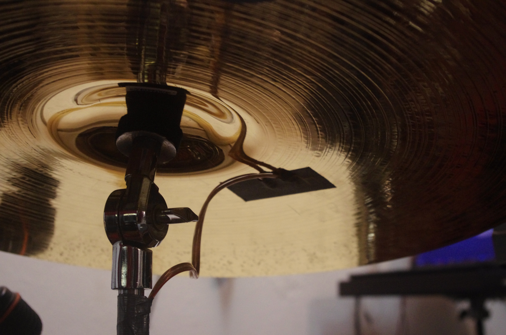
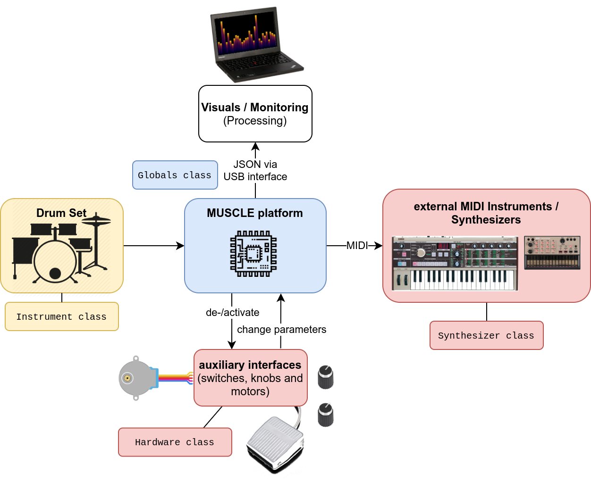
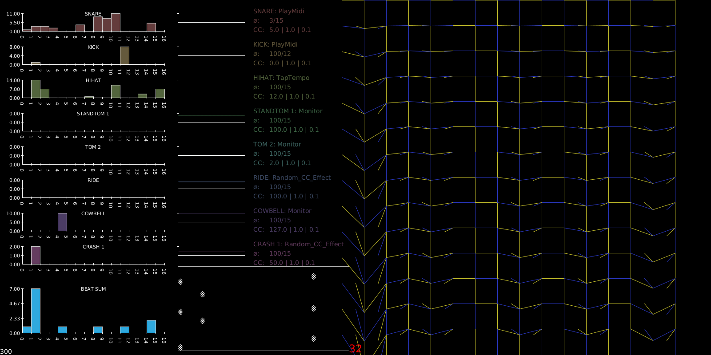

# SUPER MUSCLE
## Summoning Percussive Music Using Live Electronics
### Master Thesis

- Student: David Unland
- Supervisors: Dennis Paul, Kilian Schwoon
- Semester:  WS 2020/2021

<iframe src="https://player.vimeo.com/video/489299324" width="640" height="360" frameborder="0" allow="autoplay; fullscreen" allowfullscreen></iframe>

## Description:

SUPER MUSCLE is an embedded platform for real-time composition and improvisation on a Drum Set using Live Electronics. It combines the sounds of an acoustic drum set with electronic sounds of physical synthesizers. The system is sophisticated enough to detect rhythms and trigger sounds, while the drummer does not have to care about neither turning knobs on external devices nor a backtrack. The only human-machine interfaces should be the sticks and the drums. Plug&Play is an essential requirement that I have towards the system I built, and it should prevail over all extensions I will probably add to it.

The guitar world is dominated by legions of effect pedals, bringing us mostly single-function-effects like delays, reverbs, tremolos, choruses and distortions. SUPER MUSCLE extends this idea to the world of percussion. It is a first approach to explore what an equivalent drum effects box would require.

The play of the Drum Set will be recognized by the microcontroller. Incoming signals can be processed and used to trigger MIDI signals on external devices. Auxiliary interfaces such as foot switches and knobs can be implemented. Additionally, actuators like transducers or motors could be attached to create a more physical experience.
The capacities of the used processor allow the additional communication with a computer to
generate real-time visuals to the music.

A processing sketch is fed through the Serial interface of the Microcontroller, supplying a Monitor capable of repesenting the log of the played rhythm. Informed by the rhythm's parameters, an aesthetic output can be created, that (can be both visually appealing and) can help acquiring an intuitive access to the machine's metadata.

## Features:
- a variety of instrument effects that can trigger MIDI notes and change MIDI CC values
- Live composition based on beat log parameters - such as the density, regularity, accuracy and speed of the playing.
- reliable stroke detection and quantization system with tap tempo assigned to any instrument
- possibility to connect MIDI devices (Synthesizers and similar) and non-MIDI-machinery, such as motors, transducers, lights, ...
- for many more features read the manual at the [project's GitHub Site](https://github.com/dunland/muscle)

## Links:

[Project Website](http://david.unland.eu/muscle)

[project GitHub Code repository & Documentation](https://github.com/dunland/muscle)
