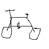

# Wunschliste von David

- **SSD Festplatte** für Lenovo W530, z.B. ebay --> "samsung 830 ssd"
- **Arbeitsspeicher** für Lenovo W530, z.B. 8GB Modul: https://www.compuram.de/arbeitsspeicher/lenovo/notebook/thinkpad/w-series/w530-quad-core/?st=tab_maxmem
- **lange Wollunterwäsche** von impulse oder hessnatur oder sowas (Unterhose + langärmliges Unterhämd)
- (Geld für) eine **Jeans** 39x41 / schwarz
- **Joggingschuhe**
- eine **Klangschale** à la:   
  
- **Schallpladden**:
   - Explosions In The Sky - Take Care, Take Care, Take Care
   - Warm Graves
   - Radiohead: King of Limbs, A Moon Shaped Pool, Kid A, Hail to the Thiefs
   - Caddywhompus - Feathering A Nest
   - Devendra Banhart - Smokey Rolls Down Thunder Canyon
   - The Dodos: Visiter, No Color, Carrier
   - Nick Drake - Pink Moon
   - Jon Hopkins - Immunity, Singularity
   - Metronomy - Love Letters / English Riviera
   - sigur rós - takk
   - sóley ask the deep
- Bandcamp- oder Schallplattenladengutschein
- ein Roman mit Thrill ohne Krimi.
- Literaturauswahl:
  - Bücher von Oliver Sacks
  - Bully Culture: Enlightenment, Romanticism, and the Transcendental Pretense, 1750-1850  https://www.goodreads.com/book/show/2575113-bully-culture
  - Self, No Self?: Perspectives from Analytical, Phenomenological, and Indian Traditions https://www.goodreads.com/book/show/10336218-self-no-self
  - Waking, Dreaming, Being: Self and Consciousness in Neuroscience, Meditation, and Philosophy https://www.goodreads.com/book/show/22329411-waking-dreaming-being
  - Mind in Life: Biology, Phenomenology, and the Sciences of Mind https://www.goodreads.com/book/show/194066.Mind_in_Life
  - The Embodied Mind: Cognitive Science and Human Experience https://www.goodreads.com/book/show/243436.The_Embodied_Mind
  - Peter Schaar: Trügerische Sicherheit http://web.archive.org/web/20170912213756/https://www.koerber-stiftung.de/publikationen/shop-portal/show/truegerische-sicherheit-237.html
  - Frank pasquale - the black Box society: the secret algorithms that control money and information, Cambridge 2015
  - Kenneth Cukier und Viktor Mayer-Schönberger: Big Data - über Utopie und Distopie in neuen Technologien
  - David R. Montgomery: Dirt
- n schnelles Fahrrad, wahlweise das von Lukas aus der Garage  

